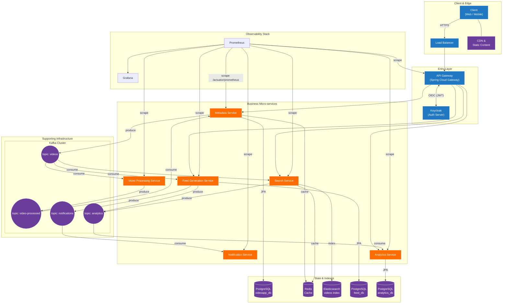

# System Design Document

# about
This is a fictitious distributed system (like a mini YouTube/Instagram backend) at scale with the following components:

* **API Gateway & Load Balancer:** This is mostly the Entry point for clients, routing requests to microservices and handling various other concerns (authentication, rate limiting, etc). If needed, it can be separated into multiple services.
* **IAM (Identity Access Management):** Using Keycloak 26.2.1 for user identity management (login, JWT token issuance) and securing service endpoints.
* **Metadata Service:** A service for managing metadata of content (e.g. video info), backed by PostgreSQL and cached with Redis.
* **Video Processing Service:** Processes uploaded videos (simulated processing like generating thumbnails), using a work queue (Kafka) for asynchronous tasks.
* **Search Service (Aggregator):** Indexes and searches content using Elasticsearch (search index) and Redis for caching frequent queries.
* **Notification Service:** Sends notifications (e.g. emails or messages) to users based on events (like new content or activities), via an event queue.
* **Feed Generation Service:** Creates personalized content feeds for users (e.g. news feed of videos) by aggregating events and data, using Kafka and database storage.
* **CDN/Static Content:** Serves static media (images/videos) via a content delivery network or static server, decoupled from core services.
* **Data Warehousing & Analytics:** An offline data processing component (simulated with a simple analytics service) that consumes events to produce reports and metrics stored in a data warehouse, which we’ll visualize on an analytics dashboard.
* **Observability:** Integration of Prometheus (v3.3) for metrics monitoring (with Grafana dashboards) and using centralized logging/tracing tools (mentioning their roles).
* **Frontend Analytics Dashboard:** A simple front-end written in TypeScript to display system metrics or analytical data by interacting with the backend services’ APIs.

# Architecture design
## High-Level Architecture
Use [mermaid chart](https://www.mermaidchart.com/) to draw / modify the architecture diagram

